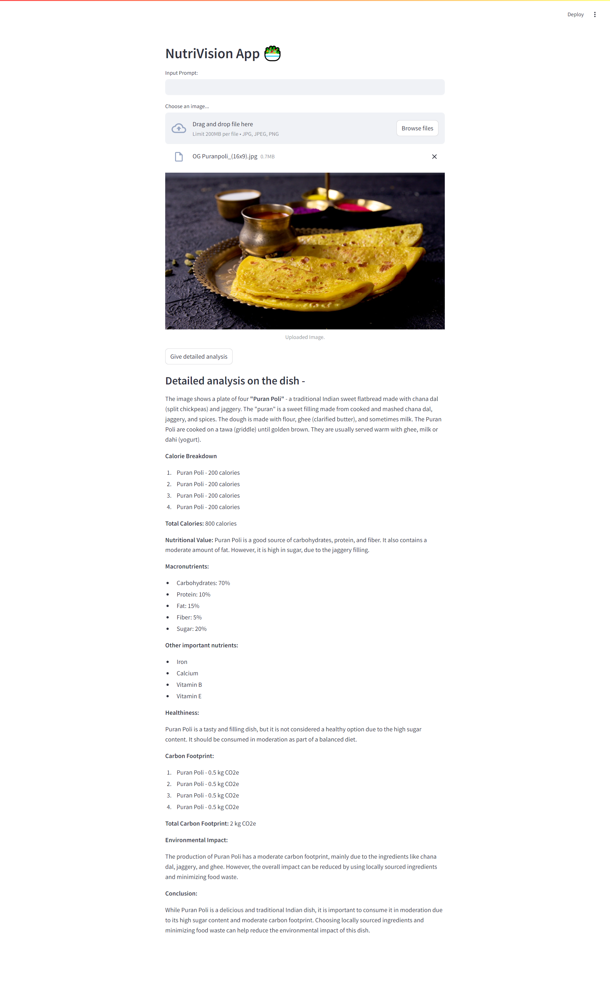

# NutriVision 🥗

NutriVision is a cutting-edge application that leverages Generative AI to analyze images of food items. It provides detailed descriptions, calculates total calorie intake, evaluates the nutritional content, and assesses the environmental impact of the food. 

## Features

- **Image Upload 📷**: Upload images of food items.
- **Nutritional Analysis 🍏**: Get detailed descriptions and calorie counts for each food item in the image.
- **Health Evaluation 💪**: Determine whether the food is healthy and receive a breakdown of its nutritional content.
- **Environmental Impact 🌍**: Assess the carbon footprint of the food items and get recommendations on their environmental friendliness.

## Installation🛠️

1. **Clone the repository**:
    ```bash
    git clone https://github.com/SnehaDeshmukh28/NutriVision-App
    ```
2. **Navigate to the project directory**:
    ```bash
    cd NutriVision
    ```
3. **Create and activate a virtual environment**:
    ```bash
    python -m venv env
    source env/bin/activate   # On Windows, use `env\Scripts\activate`
    ```
4. **Install the required packages**:
    ```bash
    pip install -r requirements.txt
    ```

## Configuration

1. **Set up your Google API key 🔑**:
    - Obtain an API key from the Google Cloud Console.
    - Create a `.env` file in the project directory and add your API key:
      ```plaintext
      GOOGLE_API_KEY=your_google_api_key_here
      ```

## Usage

1. **Run the Streamlit app 🚀**:
    ```bash
    streamlit run app.py
    ```
2. **Upload an image**:
    - Navigate to the Streamlit web interface.
    - Use the file uploader to select an image of food items.
3. **Enter a prompt**:
    - Input a prompt in the text box provided.
4. **Submit**:
    - Click the "Give detailed analysis" button to receive a detailed analysis of the uploaded image.

## Example 🖼️

1. **Upload an image of the Food Item**:

    
2. **View the detailed analysis**:
    ## Sample 1 - PuranPoli(Indian delicacy)
    

    ## Sample 2 - French Salad
    

## License

This project is licensed under the MIT License. See the [LICENSE](LICENSE) file for more information.

## Contact 📫

If you have any questions, feel free to reach out to the project maintainers:

- Name: Sneha Deshmukh | deshmusn@gmail.com
- GitHub: [SnehaDeshmukh28](https://github.com/SnehaDeshmukh28)

---

Thank you for using NutriVision!🙏🏻 We hope it helps you make informed decisions about your food choices and their impact on your health and the environment.
